# Redis面试题

[TOC]

## 一、Redis主从集群

​	尽管单节点的Redis集群已经可以应对上万并发，但是当项目规模逐渐庞大，就必须进一步提高Redis的并发能力，我们可以通过搭建Redis主从集群来实现读写分离，提高并发能力。

### 1.1 Redis主从集群结构

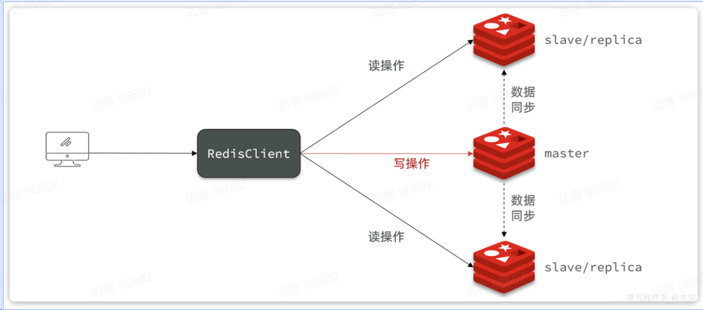

主节点叫**master**，从节点叫**slave**，如果是写操作应该访问master主节点，由master主节点将数据同步给slave从节点，如果是读操作，由各个slave从节点分担进行。

### 1.2 Redis主从同步的原理

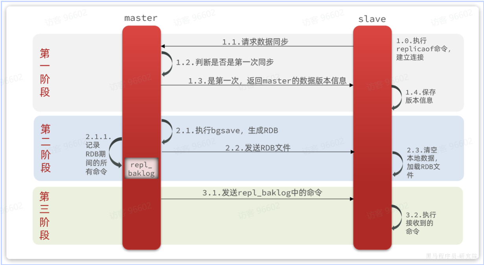

1.从节点执行replicationof命令，建立与主节点的连接。

2.从节点向主节点请求数据同步

3.主节点判断从节点是不是第一次请求同步

4.如果是第一次请求同步，返回自身的数据版本信息，如果不是进入增量同步阶段，也就是图上的第三阶段，主节点直接从repl_baklog文件中查找从节点需要同步的命令，然后将命令发送给从节点，从节点执行命令，实现数据同步。

5.刚刚说到如果从节点是第一次请求数据同步，从节点保存主节点的数据版本信息。但是这只是版本信息，不是数据，只是用来判断是全量同步还是增量同步，简而言之就是用来判断是进入第二阶段还是第三阶段，刚刚我们说完了第三阶段，现在来看第二阶段，在第二阶段中，主节点会执行bgsave命令，生成RDB文件，主节点向从节点发送RDB文件，从节点清空本地数据，加载接受到的RDB文件。

*问题1：主节点是如何知道从节点是否是第一次来同步的呢*

答：在Redis中，每一个主节点都有自己唯一的replid，但是当一个主节点成为另一个主节点的从节点时候，其自身的repld就会与绑定的主节点的id一致，offset也会与主节点同步，主节点正是通过判断replid是否一致来判断从节点是否是第一次请求数据。

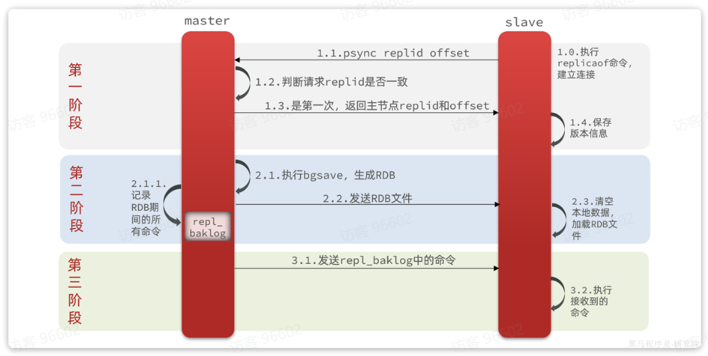

*问题2：master怎么知道slave与自己的数据差异在哪里呢?*

答：通过从节点发送的“复制偏移量”，当第一次请求主节点，主节点检查其复制偏移量是否是0，进而判断是全量同步还是增量同步，如果是全量同步，开始第二阶段的RDB文件传输，如果是增量同步，那么开始根据offset复制偏移量在repl_baklog中查找后续的命令，实现增量同步；

这就要说到全量同步时的`repl_baklog`文件了。这个文件是一个固定大小的数组，只不过数组是环形，也就是说**角标到达数组末尾后，会再次从0开始读写**，这样数组头部的数据就会被覆盖。

`repl_baklog`中会记录Redis处理过的命令及`offset`，包括master当前的`offset`，和slave已经拷贝到的`offset`：

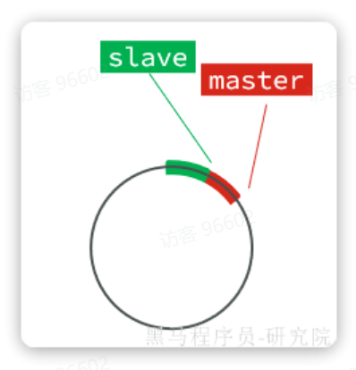

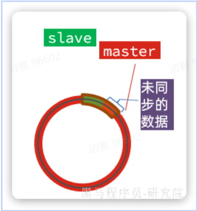

问题3：如何优化Redis的主从集群

1.痛点：全量同步时候写RDB到磁盘，IO压力大。

   方案：在master主节点中配 `repl-diskless-sync yes`（无磁盘复制）。

2.痛点：节点内存太大，生成 RDB 文件时磁盘 IO 和耗时都增加。

​    方案：控制单节点内存，别太大。

3.痛点：slave 宕机久了，`repl_baklog`存不下宕机期间的命令，重启后只能全量同步。

​    方案：调大 `repl_baklog` 大小。

4.痛点：一个 master 挂太多 slave，同步请求挤爆 master。

​    方案：限制 slave 数量，或用 “主→从→从” 链式结构（让部分 slave 从其他 slave 同步）。

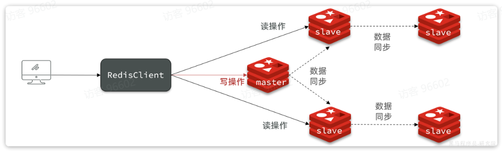

问题4：简述全量同步和增量同步区别？

- 全量同步：master将完整内存数据生成RDB，发送RDB到slave。后续命令则记录在repl_baklog，逐个发送给slave。
- 增量同步：slave提交自己的offset到master，master获取repl_baklog中从offset之后的命令给slave。

问题5：什么时候执行全量同步？

- slave节点第一次连接master节点时
- slave节点断开时间太久，repl_baklog中的offset已经被覆盖时

问题6：什么时候执行增量同步？

- slave节点断开又恢复，并且在`repl_baklog`中能找到offset时

## 二、Redis哨兵模式

主从结构中master节点的作用非常重要，一旦故障就会导致集群不可用。那么有什么办法能保证主从集群的高可用性呢？

### 2.1.哨兵作用

哨兵的作用如下：

- **集群监控**：`Sentinel` 会不断检查您的`master`和`slave`是否按预期工作
- **故障恢复（failover）**：如果`master`故障，`Sentinel`会将一个`slave`提升为`master`。当故障实例恢复后会成为`slave`
- **状态通知**：`Sentinel`充当`Redis`客户端的服务发现来源，当集群发生`failover`时，会将最新集群信息推送给`Redis`的客户端

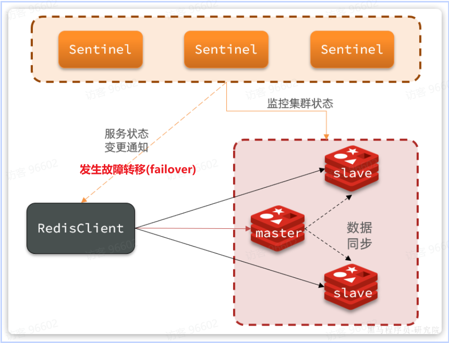

### 2.2.状态监控

`Sentinel`基于心跳机制监测服务状态，每隔1秒向集群的每个节点发送ping命令，并通过实例的响应结果来做出判断：

- **主观下线（sdown）**：如果某sentinel节点发现某Redis节点未在规定时间响应，则认为该节点主观下线。
- **客观下线(odown)**（防止单个 Sentinel 节点的误判导致不必要的故障转移）：若超过指定数量（通过`quorum`设置）的sentinel都认为该节点主观下线，则该节点客观下线。quorum值最好超过Sentinel节点数量的一半，Sentinel节点数量至少3台。

注：故障转移指的是当系统中的某个组件（如服务器、网络链路）发生故障时，自动将其工作负载转移到备用组件上，以确保服务不中断的技术机制。它的核心目标是提升系统的**高可用性**，避免单点故障导致整个服务瘫痪。

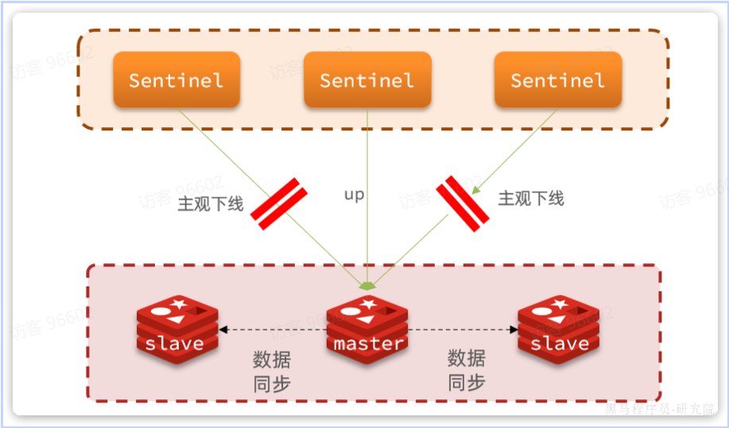

Redis Sentinel 选新主库的简单逻辑：

1. 先筛掉和老主库断开太久的从库（超过设定时间 10 倍）；
2. 剩下的比优先级（slave-priority），值越小越优先（0 不参与）；
3. 优先级相同，比数据同步进度（offset），越大越优先；
4. 还相同，比运行 ID（run_id），越小越优先。

问题来了，当选出一个新的master后，该如何实现身份切换呢？

大概分为两步：

- 在多个`sentinel`中选举一个`leader`
- 由`leader`执行`failover`

### 2.3.选举leader

要成为执行 failover 的 leader，Sentinel 节点必须同时满足以下两点：

1. 最先获得**超过半数**的集群总投票。
2. 获得的投票数**不小于 quorum 值**（quorum 是 Sentinel 配置中判断 master 下线的最小节点数）。

集群节点投票时，遵循固定逻辑，确保投票方向明确：

- 原则一：优先给当前**得票最多**的节点投票。
- 原则二：若当前无任何节点得票，节点会**投给自己**。

触发时机：**第一个确认 master 节点客观下线的 Sentinel**，会立刻发起投票。

结果规律：结合投票原则，先发起投票者会先给自己投 1 票，后续节点因 “优先投给得票最多者”，会陆续投给它，使其轻松满足当选条件，因此该节点通常会成为 leader。

### 2.4 找到`leader`以后，如何完成`failover`

我们举个例子，有一个集群，初始状态下7001为`master`，7002和7003为`slave`：

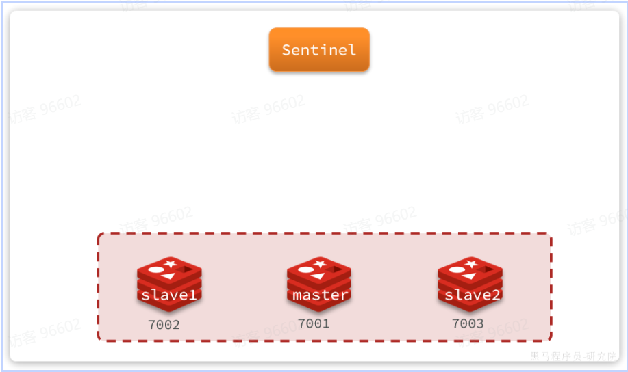

假如master发生故障，slave1当选。则故障转移的流程如下：

`sentinel`给备选的`slave1`节点发送`slaveof no one`命令，让该节点成为`master`

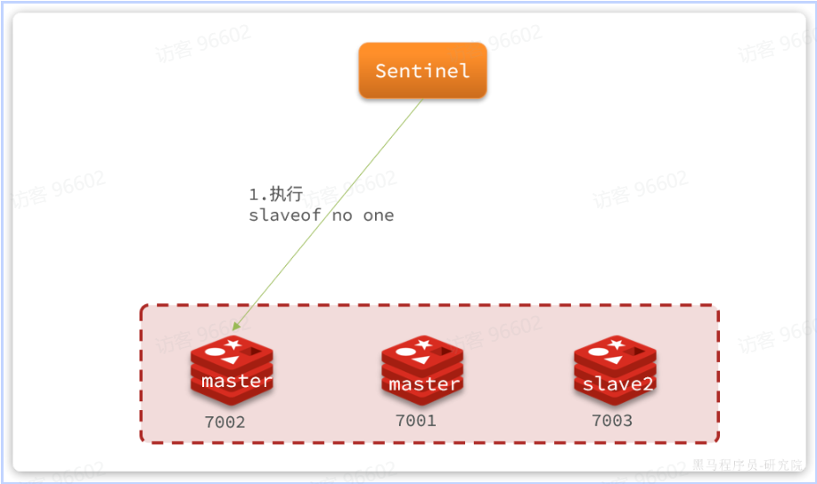

`sentinel`给所有其它`slave`发送`slaveof 192.168.150.101 7002` 命令，让这些节点成为新`master`的slave节点，也就是`7002`的`slave`节点，开始从新的`master`上同步数据。

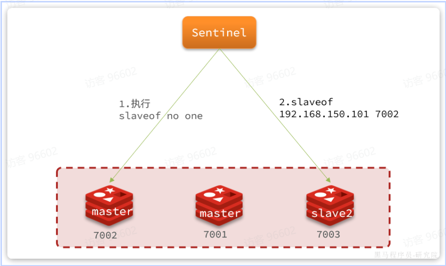

最后，当故障节点恢复后会接收到哨兵信号，执行`slaveof 192.168.150.101 7002`命令，成为`slave`：（Sentinel直接修改这个故障节点文件,让这个节点醒来的时候知道自己是slave,视频说sentinel直接修改故障节点的配置文件，故障节点恢复后自动就会成为7002的slave）

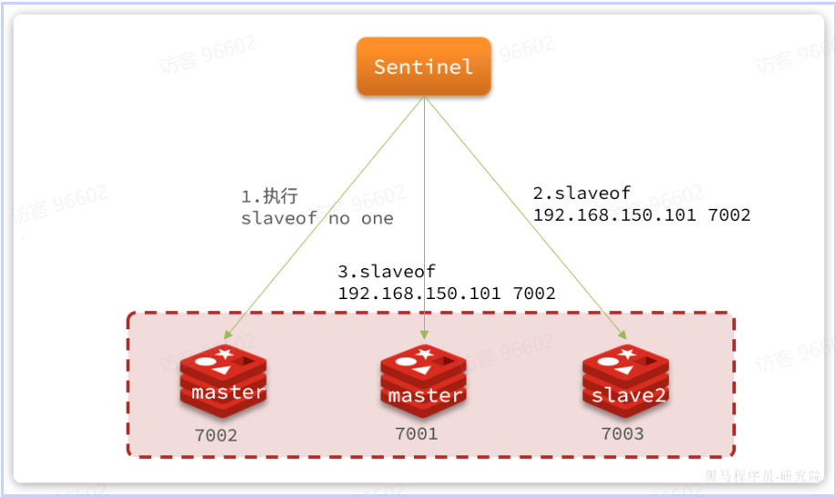

问题7：Sentinel如何判断一个redis实例是否健康？

- 每隔1秒发送一次ping命令，如果超过一定时间没有响应则认为是主观下线（`sdown`）
- 如果大多数sentinel都认为实例主观下线，则判定服务客观下线（`odown`）

问题8：故障转移步骤有哪些？

- **Sentinel 选主（Leader Election）**：当多个 Sentinel 检测到 master 故障后，通过 Raft 协议选举出 1 个 Leader，仅由 Leader 执行后续故障转移操作。
- **筛选并确认新 master**：Leader 按规则筛选从节点，确认新 master 后，向其发送`slaveof noone`命令，使其切换为 master 模式。
- **同步所有从节点**：Leader 向其他所有从节点发送`slaveof 新master`命令，让它们开始同步新 master 的数据。
- **更新配置并通知客户端**：Leader 更新自身及其他 Sentinel 的配置，记录新 master 信息，同时向客户端发送 “新 master 地址” 的通知。
- **故障节点自动归队**：待故障节点恢复后，Sentinel 检测到其状态正常，自动向其发送`slaveof 新master`命令，使其作为从节点重新加入集群。

问题9：sentinel选举leader的依据是什么？

- 票数超过sentinel节点数量1半
- 一般情况下最先发起failover的节点会当选

注意：`quorum`的作用：**判断 master 是否客观下线的最小同意票数**，是触发故障转移的前提，与 Leader 选举的票数规则无关。

问题10：

sentinel从slave中选取master的依据是什么？

- 首先会判断slave节点与master节点断开时间长短，如果超过`down-after-milliseconds`` * 10`则会排除该slave节点
- 然后判断slave节点的`slave-priority`值，越小优先级越高，如果是0则永不参与选举（默认都是1）。
- 如果`slave-prority`一样，则判断slave节点的`offset`值，越大说明数据越新，优先级越高
- 最后是判断slave节点的`run_id`大小，越小优先级越高（`通过info server可以查看run_id`）。

## 三、Redis分片集群

主从模式可以解决高可用、高并发读的问题。但依然有两个问题没有解决：

- 海量数据存储
- 高并发写

要解决这两个问题就需要用到分片集群了。分片的意思，就是把数据拆分存储到不同节点，这样整个集群的存储数据量就更大了。

Redis分片集群的结构如图：

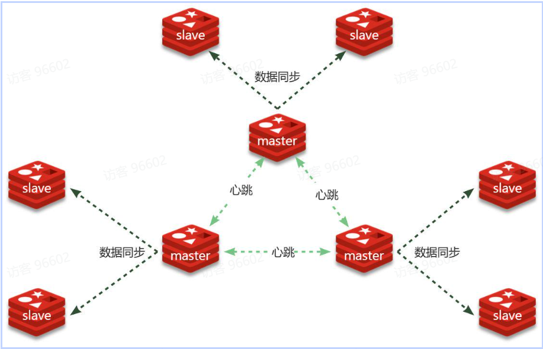

分片集群特征：

-  集群中有多个master，每个master保存不同分片数据 ，解决海量数据存储问题
-  每个master都可以有多个slave节点 ，确保高可用
-  master之间通过ping监测彼此健康状态 ，类似哨兵作用
-  客户端请求可以访问集群任意节点，最终都会被转发到数据所在节点

### 3.1 散列插槽

#### 1. 核心机制：16384 个散列插槽

Redis 集群共有 16384 个固定 hash slot，数据分片的核心就是将这些插槽分配给不同 master 节点，作为数据存储和查询的 “地址依据”。

- 集群创建时会指定插槽分配，例如 3 个 master 节点常见分配方式为：
  - Master [0]（如 7001 节点）：负责 0~5460 号插槽
  - Master [1]（如 7002 节点）：负责 5461~10922 号插槽
  - Master [2]（如 7003 节点）：负责 10923~16383 号插槽

#### 2. 插槽计算规则：key 决定 slot 归属

读写数据时，Redis 会先计算 key 对应的 slot 值，再将操作路由到该 slot 所属节点，计算分两种情况：

- **key 不含 {}**：直接对整个 key 字符串用 CRC16 算法哈希，结果与 16384 取余得到 slot。
- **key 含 {}**：仅对`{}`之间的字符串计算 hash slot，实现相同内容归到同一节点（如`user:{age}`和`info:{age}`会在同一 slot）。

注：Redis 分片集群通过将数据划分为 16384 个固定槽位，让不同 master 节点负责不同槽位来解决海量数据存储问题，每个 master 还可搭配 slave 保障高可用，且集群初始化或新增节点时，会将 “槽位 - 节点” 的分片信息同步给所有节点（该信息仅为映射关系，体量极小，不增加节点存储压力，节点仅实际存储自身负责槽位的业务数据）；客户端请求可访问任意节点，该节点会依据分片信息将请求转发到数据所属的目标节点，无需客户端记忆数据位置

### 3.2 故障转移

分片集群的节点之间会互相通过ping的方式做心跳检测，超时未回应的节点会被标记为下线状态。当发现master下线时，会将这个master的某个slave提升为master。

过程：

#### 1. 故障检测：确认 master 下线

这一步是转移的前提，依赖集群的心跳机制实现。

- 集群内所有节点（包括其他 master、slave）会定期向目标 master 发送 ping 请求，检测其存活状态。
- 当多个节点（通常需达到预设 “仲裁数”）在指定超时时间内，持续未收到目标 master 的 pong 响应，会共同判定该 master “下线”。
- 判定后，集群会将该 master 标记为 “故障状态”，并同步这一信息给所有相关节点（尤其是它的 slave 节点）。

#### 2. 选主：从 slave 中选新 master

选主遵循 “数据最新、优先级最高” 的原则，确保新 master 能无缝承接服务。

- 首先筛选候选 slave：排除与故障 master 数据同步滞后过多的 slave（避免数据丢失），只保留 “已完成大部分数据同步” 的 slave 进入候选池。
- 然后按优先级排序：优先选择配置中 “slave 优先级” 更高的节点；若优先级相同，再比较 “与故障 master 的同步进度”，同步越完整的越优先。
- 最后确定新 master：通过集群内投票或预设规则，从候选 slave 中选出 1 个，将其状态标记为 “新 master”。

####  3. 切换：完成角色与流量转移

这一步是最终落地，确保业务流量能平滑切换到新 master。

- 角色切换：新 master 会更新自身配置，正式承担原 master 的职责（如处理写请求、接收其他 slave 的同步请求）。
- 从节点同步：原故障 master 的其他 slave，会停止向旧 master 同步数据，改为向新 master 发起数据同步请求，确保集群数据一致性。
- 流量切换：集群的路由组件（如 MongoDB 的 mongos、Redis 的哨兵）会更新路由表，将原本指向旧 master 的读写流量，自动转发到新 master，整个过程对业务通常透明。

问题11：Redis分片集群如何判断某个key应该在哪个实例？

- 将16384个插槽分配到不同的实例
- 根据key计算哈希值，对16384取余
- 余数作为插槽，寻找插槽所在实例即可

问题12：如何将同一类数据固定的保存在同一个Redis实例？

- Redis计算key的插槽值时会判断key中是否包含`{}`，如果有则基于`{}`内的字符计算插槽
- 数据的key中可以加入`{类型}`，例如key都以`{typeId}`为前缀，这样同类型数据计算的插槽一定相同

## 四、 Redis数据结构

我们常用的Redis数据类型有5种，分别是：

- String
- List
- Set
- SortedSet
- Hash

还有一些高级数据类型，比如Bitmap、HyperLogLog、GEO等，其底层都是基于上述5种基本数据类型。因此在Redis的源码中，其实只有5种数据类型。

不管是任何一种数据类型，最终都会封装为RedisObject格式，它是一种结构体，C语言中的一种结构，可以理解为Java中的类。

结构大概是这样的：

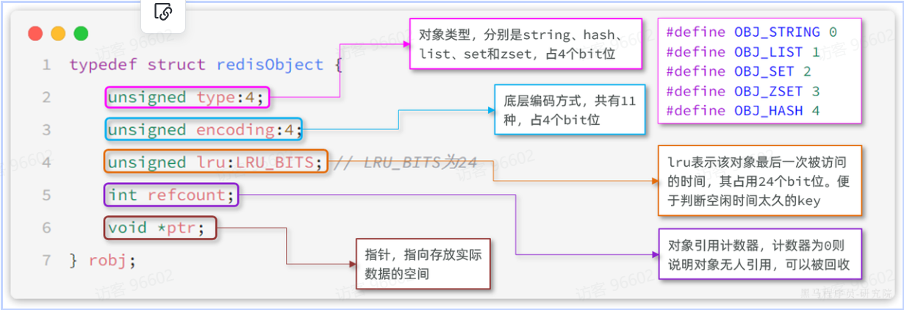

可以看到整个结构体中并不包含真实的数据，仅仅是对象头信息，内存占用的大小为4+4+24+32+64 = 128bit

也就是16字节，然后指针`ptr`指针指向的才是真实数据存储的内存地址。所以RedisObject的内存开销是很大的。

存储多个数据时优先选 list/set 而非多个 string，核心是通过**减少 RedisObject 头信息和 key 的重复数量**来节省空间、降低管理成本，具体可归为三点：

1. **减少 RedisObject 开销**：多个 string 需为每条数据创建 1 个 RedisObject，而 1 个 list/set 可封装所有数据，仅需 1 个 RedisObject，直接避免大量重复头信息浪费。
2. **减少 key 数量**：多个 string 对应多个独立 key，易造成 “key 爆炸”；list/set 只需 1 个 key，能简化 Redis 对 key 的管理，同时降低查找耗时。
3. **优化操作效率**：对批量数据的添加、删除等操作，list/set 通过 1 个 key 即可完成，无需遍历多个 string 的 key，操作更高效。

### 4.1 SkipList（跳表）

- SkipList（跳表）首先是链表，但与传统链表相比有几点差异：

  - 元素按照升序排列存储
  - 节点可能包含多个指针，指针跨度不同。

  传统链表只有指向前后元素的指针，因此只能顺序依次访问。如果查找的元素在链表中间，查询的效率会比较低。而SkipList则不同，它内部包含跨度不同的多级指针，可以让我们跳跃查找链表中间的元素，效率非常高。

  其结构如图：

  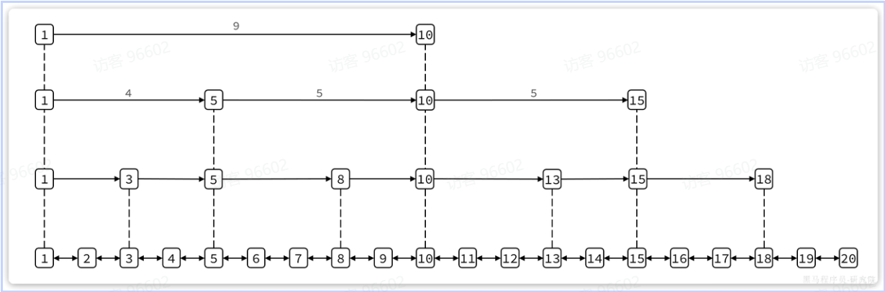

我们可以看到1号元素就有指向3、5、10的多个指针，查询时就可以跳跃查找。例如我们要找大小为14的元素，查找的流程是这样的：

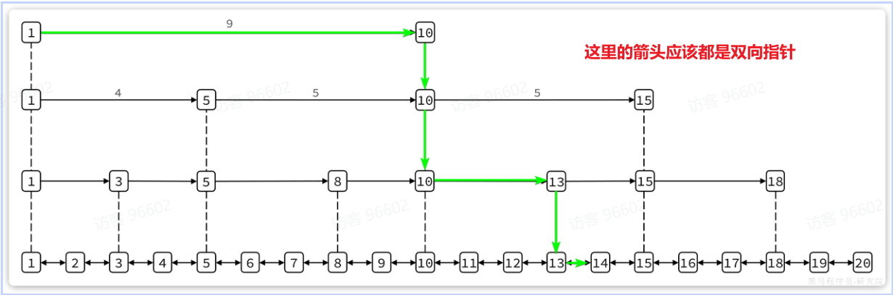

- 首先找元素1节点最高级指针，也就是4级指针，起始元素大小为1，指针跨度为9，可以判断出目标元素大小为10。由于14比10大，肯定要从10这个元素向下接着找。
- 找到10这个元素，发现10这个元素的最高级指针跨度为5，判断出目标元素大小为15，大于14，需要判断下级指针
- 10这个元素的2级指针跨度为3，判断出目标元素为13，小于14，因此要基于元素13接着找
- 13这个元素最高级级指针跨度为2，判断出目标元素为15，比14大，需要判断下级指针。
- 13的下级指针跨度为1，因此目标元素是14，刚好于目标一致，找到。

这种多级指针的查询方式就避免了传统链表的逐个遍历导致的查询效率下降问题。在对有序数据做随机查询和排序时效率非常高。

### 4.2 SortedSet

问题13：**面试题**：Redis的`SortedSet`底层的数据结构是怎样的？

**答**（优秀版）：SortedSet是有序集合，底层的存储的每个数据都包含element和score两个值。score是得分，element则是字符串值。SortedSet会根据每个element的score值排序，形成有序集合。

它支持的操作很多，比如：

- 根据element查询score值
- 按照score值升序或降序查询element

要实现根据element查询对应的score值，就必须实现element与score之间的键值映射。SortedSet底层是基于**HashTable**来实现的。

要实现对score值排序，并且查询效率还高，就需要有一种高效的有序数据结构，SortedSet是基于**跳表**实现的。

加分项：因为SortedSet底层需要用到两种数据结构，对内存占用比较高。因此Redis底层会对SortedSet中的元素大小做判断。如果**元素大小****小于128**且**每个元素都小于64字节**，SortedSet底层会采用**ZipList**，也就是**压缩列**表来代替**HashTable**和**SkipList**

不过，`ZipList`存在连锁更新问题，因此而在Redis7.0版本以后，`ZipList`又被替换为**Listpack**（紧凑列表）。

答（简化版）：SortedSet 底层是「HashTable + 跳表」的组合，前者快速查元素分数，后者实现分数有序排序；但如果元素数量少、体积小，7.0 前用 ZipList、7.0 后用 Listpack 优化内存，避免浪费

## 五、Redis内存回收

Redis之所以性能强，最主要的原因就是基于内存存储。然而单节点的Redis其内存大小不宜过大，会影响持久化或主从同步性能。

当内存达到上限，就无法存储更多数据了。因此，Redis内部会有两套内存回收的策略：

- 内存过期策略
- 内存淘汰策略

###  5.1.内存过期处理

存入Redis中的数据可以配置过期时间，到期后再次访问会发现这些数据都不存在了，也就是被过期清理了。

那么问题来了：

- Redis如何判断一个KEY是否过期呢？
- Redis又是何时删除过期KEY的呢？

Redis不管有多少种数据类型，本质是一个`KEY-VALUE`的键值型数据库，而这种键值映射底层正式基于HashTable来实现的，在Redis中叫做Dict.

问题14：**面试题**：Redis如何判断KEY是否过期呢？

**答**：在Redis中会有两个Dict，也就是HashTable，其中一个记录KEY-VALUE键值对，另一个记录KEY和过期时间。要判断一个KEY是否过期，只需要到记录过期时间的Dict中根据KEY查询即可

问题15：Redis是何时删除过期KEY的呢？

Redis并不会在KEY过期时立刻删除KEY，因为要实现这样的效果就必须给每一个过期的KEY设置时钟，并监控这些KEY的过期状态。无论对CPU还是内存都会带来极大的负担。

Redis的过期KEY删除策略有两种：

- 惰性删除
- 周期删除

**惰性删除**，顾明思议就是过期后不会立刻删除。那在什么时候删除呢？

Redis会在每次访问KEY的时候判断当前KEY有没有设置过期时间，如果有，过期时间是否已经到期。

**周期删除**：顾明思议是通过一个定时任务，周期性的抽样部分过期的key，然后执行删除。

执行周期有两种：

- **SLOW模式：**Redis会设置一个定时任务`serverCron()`，按照`server.hz`的频率来执行过期key清理
- **FAST模式：**Redis的每个事件循环前执行过期key清理（事件循环就是NIO事件处理的循环）。

### 5.2 内存淘汰策略

对于某些特别依赖于Redis的项目而言，仅仅依靠过期KEY清理是不够的，内存可能很快就达到上限。因此Redis允许设置内存告警阈值，当内存使用达到阈值时就会主动挑选部分KEY删除以释放更多内存。这叫做**内存淘汰**机制。

那么问题来了，当内存达到阈值时执行内存淘汰，但问题是Redis什么时候会执去判断内存是否达到预警呢？

好了，知道什么时候尝试淘汰了，那具体Redis是如何判断该淘汰哪些`Key`的呢？

Redis支持8种不同的内存淘汰策略：

- `noeviction`： 不淘汰任何key，但是内存满时不允许写入新数据，默认就是这种策略。
- `volatile``-ttl`： 对设置了TTL的key，比较key的剩余TTL值，TTL越小越先被淘汰
- `allkeys``-random`：对全体key ，随机进行淘汰。也就是直接从db->dict中随机挑选
- `volatile-random`：对设置了TTL的key ，随机进行淘汰。也就是从db->expires中随机挑选。
- `allkeys-lru`： 对全体key，基于LRU算法进行淘汰
- `volatile-lru`： 对设置了TTL的key，基于LRU算法进行淘汰
- `allkeys-lfu`： 对全体key，基于LFU算法进行淘汰
- `volatile-lfu`： 对设置了TTL的key，基于LFI算法进行淘汰

比较容易混淆的有两个算法：

- **LRU**（**`L`**`east `**`R`**`ecently `**`U`**`sed`），最近最久未使用。用当前时间减去最后一次访问时间，这个值越大则淘汰优先级越高。
- **LFU**（**`L`**`east `**`F`**`requently `**`U`**`sed`），最少频率使用。会统计每个key的访问频率，值越小淘汰优先级越高。

先明确 LRU 和 LFU 的核心差异：LRU 是淘汰 “最久没被访问” 的 key，依赖的是 key 的最近一次访问时间；LFU 则是淘汰 “访问次数最少” 的 key，需要同时用到访问次数和最近访问时间这两个数据。

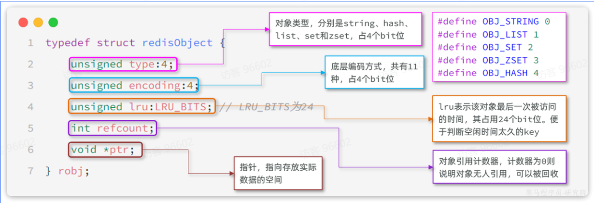

这两个关键数据都存在 RedisObject 的 lru 字段里，这个字段共 24 位，会根据选择的算法存储不同内容。用 LRU 时，lru 字段直接存 “最近一次访问时间”，单位是秒；用 LFU 时，字段会拆成两部分，高 16 位存 “最近一次访问时间”（单位是分钟，用来计算后续的次数衰减），低 8 位存 “逻辑访问次数”—— 这里要注意，这不是真实的访问次数，而是经过特殊计算的数值。

之所以叫 “逻辑访问次数”，是为了解决 8 位无符号数最大只能到 255 的问题。它的计算规则是这样的：每次 key 被访问，先生成一个 0 到 1 之间的随机数 R；再用公式`1/(旧次数 * lfu_log_factor + 1)`算出阈值 P（lfu_log_factor 默认是 10）；只有当 R 小于 P 时，访问次数才加 1，而且最大不会超过 255。同时，这个访问次数还会随时间衰减，每隔 lfu_decay_time 分钟（默认 1 分钟），次数就自动减 1，避免那些早期访问多但后来没人用的 key 一直占用内存。

这里有个关键问题：Redis 里的 key 可能有几百万甚至更多，要是每次执行命令都把所有 key 排序，找出该淘汰的那个，会严重拖慢命令执行速度，显然不现实。所以 Redis 用了 “抽样法”，每次执行命令时，只抽样 maxmemory_samples 个 key（比如默认抽样 5 个），对这些抽样的 key 按淘汰策略排序，删掉优先级最高的那个。不过 Redis 3.0 之后做了优化，引入了 “淘汰候选池”，抽样的 key 要和候选池里的 key 比，只有优先级更高的才能进入候选池，最后从候选池里挑最该淘汰的 key 删除，这样结果更接近真正的 LRU/LFU 算法，尤其是把抽样值设高（比如 10）时，效果会更准。

最后总结一下核心：LRU 看 “闲置时间”，LFU 看 “访问频率”，官方更推荐 LFU；关键数据靠 lru 字段存储，LFU 还会用概率算访问次数避免溢出；为了不拖慢速度，Redis 用 “抽样 + 候选池” 的方式找要淘汰的 key，兼顾了效率和准确性。

问题16：**面试题**：**Redis如何判断KEY是否过期呢？**

**答**：在Redis中会有两个Dict，也就是HashTable，其中一个记录KEY-VALUE键值对，另一个记录KEY和过期时间。要判断一个KEY是否过期，只需要到记录过期时间的Dict中根据KEY查询即可。

问题17：**面试题**：**Redis何时删除过期KEY？如何删除？**

答：Redis的过期KEY处理有两种策略，分别是惰性删除和周期删除。

**惰性删除**是指在每次用户访问某个KEY时，判断KEY的过期时间：如果过期则删除；如果未过期则忽略。

**周期删除**有两种模式：

- **SLOW**模式：通过一个定时任务，定期的抽样部分带有TTL的KEY，判断其是否过期。默认情况下定时任务的执行频率是每秒10次，但每次执行不能超过25毫秒。如果执行抽样后发现时间还有剩余，并且过期KEY的比例较高，则会多次抽样。
- **FAST**模式：在Redis每次处理NIO事件之前，都会抽样部分带有TTL的KEY，判断是否过期，因此执行频率较高。但是每次执行时长不能超过1ms，如果时间充足并且过期KEY比例过高，也会多次抽样

问题18：**面试题**：**当Redis内存不足时会怎么做**？

**答**：这取决于配置的内存淘汰策略，Redis支持很多种内存淘汰策略，例如LRU、LFU、Random. 但默认的策略是直接拒绝新的写入请求。而如果设置了其它策略，则会在每次执行命令后判断占用内存是否达到阈值。如果达到阈值则会基于配置的淘汰策略尝试进行内存淘汰，直到占用内存小于阈值为止。

问题19：**面试题**：**那你能聊聊LRU和LFU吗**？

**答**：`LRU`是最近最久未使用。Redis的Key都是RedisObject，当启用LRU算法后，Redis会在Key的头信息中使用24个bit记录每个key的最近一次使用的时间`lru`。每次需要内存淘汰时，就会抽样一部分KEY，找出其中空闲时间最长的，也就是`now - lru`结果最大的，然后将其删除。如果内存依然不足，就重复这个过程。

由于采用了抽样来计算，这种算法只能说是一种近似LRU算法。因此在Redis4.0以后又引入了`LFU`算法，这种算法是统计最近最少使用，也就是按key的访问频率来统计。当启用LFU算法后，Redis会在key的头信息中使用24bit记录最近一次使用时间和逻辑访问频率。其中高16位是以分钟为单位的最近访问时间，后8位是逻辑访问次数。与LRU类似，每次需要内存淘汰时，就会抽样一部分KEY，找出其中逻辑访问次数最小的，将其淘汰。

问题20：**面试题**：**逻辑访问次数是如何计算的**？

**答**：由于记录访问次数的只有`8bit`，即便是无符号数，最大值只有255，不可能记录真实的访问次数。因此Redis统计的其实是逻辑访问次数。这其中有一个计算公式，会根据当前的访问次数做计算，结果要么是次数`+1`，要么是次数不变。但随着当前访问次数越大，`+1`的概率也会越低，并且最大值不超过255.

除此以外，逻辑访问次数还有一个衰减周期，默认为1分钟，即每隔1分钟逻辑访问次数会`-1`。这样逻辑访问次数就能基本反映出一个`key`的访问热度了。

## 六、Redis缓存问题

Redis经常被用作缓存，而缓存在使用的过程中存在很多问题需要解决。例如：

- 缓存的数据一致性问题
- 缓存击穿
- 缓存穿透
- 缓存雪崩

### 6.1.缓存一致性

我们先看下目前企业用的最多的缓存模型。缓存的通用模型有三种：

- `Cache Aside`：由缓存调用者自己维护数据库与缓存的一致性。即：
  - 查询时：命中则直接返回，未命中则查询数据库并写入缓存
  - 更新时：更新数据库并删除缓存，查询时自然会更新缓存
- `Read/Write Through`：数据库自己维护一份缓存，底层实现对调用者透明。底层实现：
  - 查询时：命中则直接返回，未命中则查询数据库并写入缓存
  - 更新时：判断缓存是否存在，不存在直接更新数据库。存在则更新缓存，同步更新数据库
- `Write Behind Cahing`：读写操作都直接操作缓存，由线程异步的将缓存数据同步到数据库。

目前企业中使用最多的就是`Cache Aside`模式，因为实现起来非常简单。但缺点也很明显，就是无法保证数据库与缓存的强一致性。为什么呢？我们一起来分析一下。

`Cache Aside`的写操作是要在更新数据库的同时删除缓存，那为什么不选择更新数据库的同时更新缓存，而是删除呢？

原因很简单，假如一段时间内无人查询，但是有多次更新，那这些更新都属于无效更新。采用删除方案也就是延迟更新，什么时候有人查询了，什么时候更新。

那到底是先更新数据库再删除缓存，还是先删除缓存再更新数据库呢？

现在假设有两个线程，一个来更新数据，一个来查询数据。我们分别分析两种策略的表现。

我们先分析策略1，先删除缓存再更新数据库：

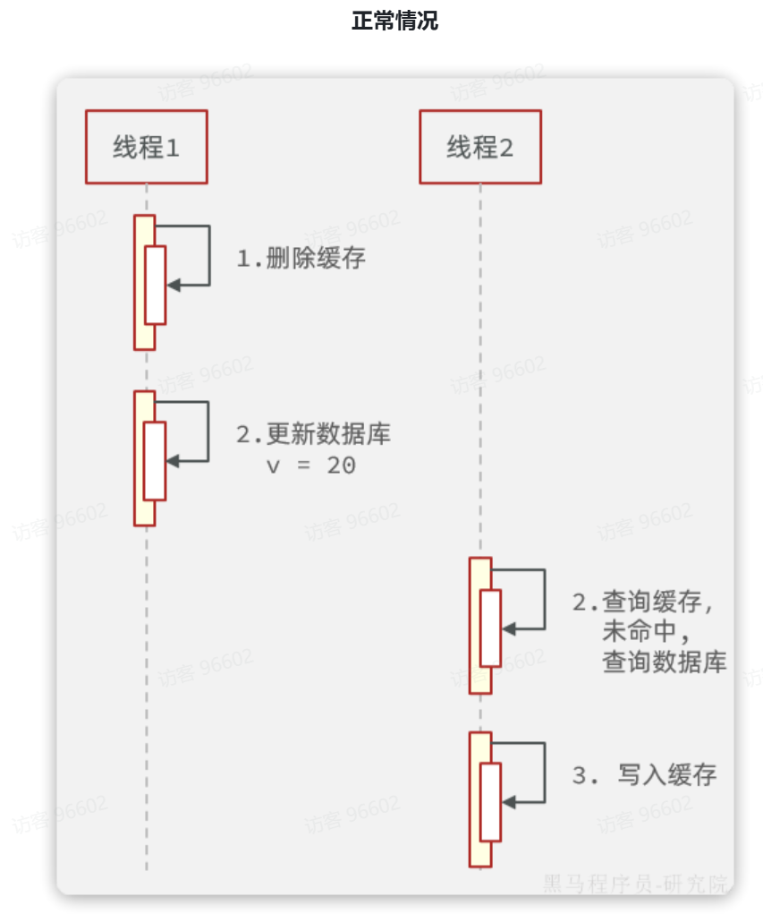

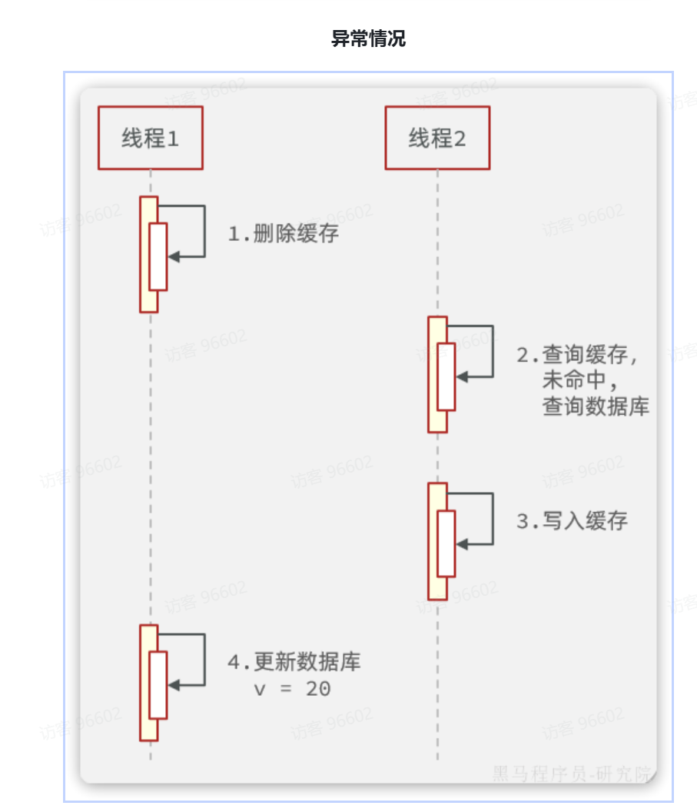

异常情况说明：

- 线程1删除缓存后，还没来得及更新数据库，
- 此时线程2来查询，发现缓存未命中，于是查询数据库，写入缓存。由于此时数据库尚未更新，查询的是旧数据。也就是说刚才的删除白删了，缓存又变成旧数据了。
- 然后线程1更新数据库，此时数据库是新数据，缓存是旧数据

由于更新数据库的操作本身比较耗时，在期间有线程来查询数据库并更新缓存的概率非常高。因此不推荐这种方案。

再来看策略2，先更新数据库再删除缓存：

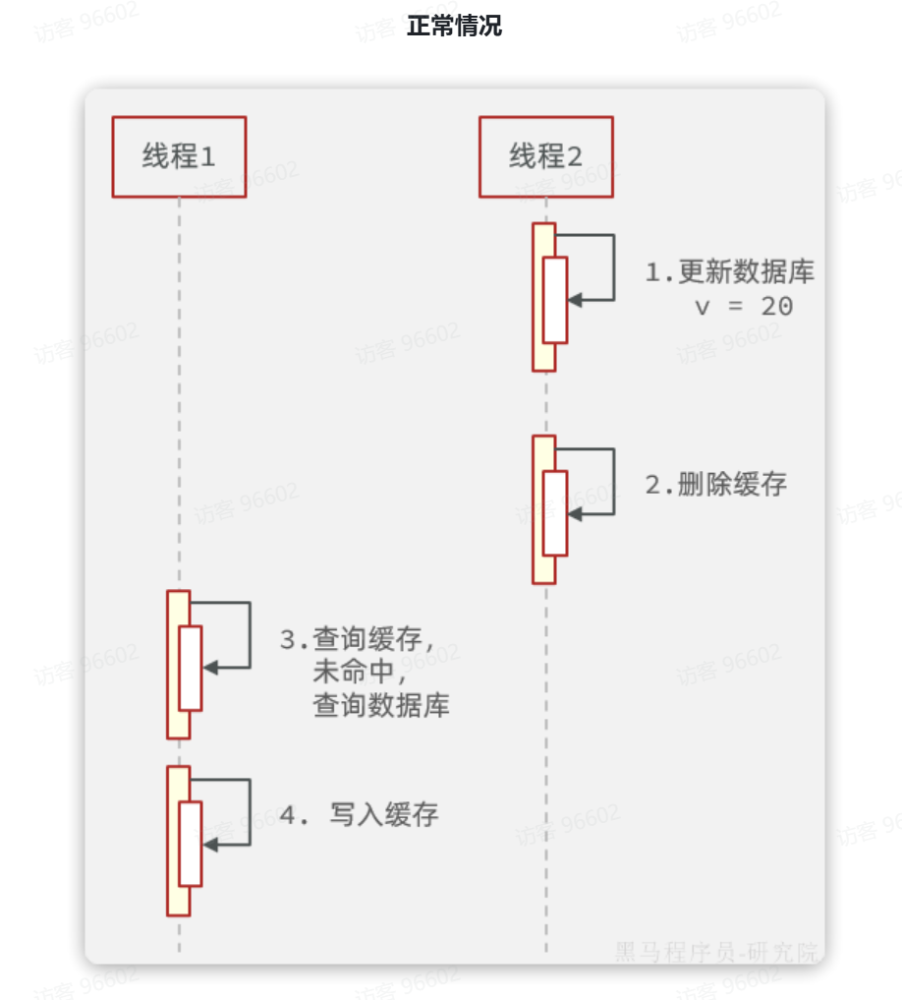

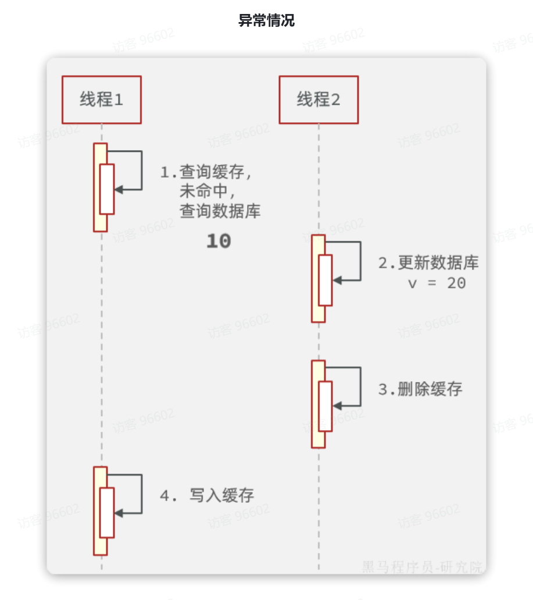

异常情况说明：

- 线程1查询缓存未命中，于是去查询数据库，查询到旧数据
- 线程1将数据写入缓存之前，线程2来了，更新数据库，删除缓存
- 线程1执行写入缓存的操作，写入旧数据

可以发现，异常状态发生的概率极为苛刻，线程1必须是查询数据库已经完成，但是缓存尚未写入之前。线程2要完成更新数据库同时删除缓存的两个操作。要知道线程1执行写缓存的速度在毫秒之间，速度非常快，在这么短的时间要完成数据库和缓存的操作，概率非常之低。

**综上**，添加缓存的目的是为了提高系统性能，而你要付出的代价就是缓存与数据库的强一致性。如果你要求数据库与缓存的强一致，那就需要加锁避免并行读写。但这就降低了性能，与缓存的目标背道而驰。

因此不管任何缓存同步方案最终的目的都是尽可能保证最终一致性，降低发生不一致的概率。我们采用先更新数据库再删除缓存的方案，已经将这种概率降到足够低，目的已经达到了。

同时我们还要给缓存加上过期时间，一旦发生缓存不一致，当缓存过期后会重新加载，数据最终还是能保证一致。这就可以作为一个兜底方案。

### 6.2 缓存穿透

什么是缓存穿透呢？

我们知道，当请求查询缓存未命中时，需要查询数据库以加载缓存。但是大家思考一下这样的场景：

> 如果我访问一个数据库中也不存在的数据。会出现什么现象？

由于数据库中不存在该数据，那么缓存中肯定也不存在。因此不管请求该数据多少次，缓存永远不可能建立，请求永远会直达数据库。

假如有不怀好意的人，开启很多线程频繁的访问一个数据库中也不存在的数据。由于缓存不可能生效，那么所有的请求都访问数据库，可能就会导致数据库因过高的压力而宕机。

解决这个问题有两种思路：

- 缓存空值
- 布隆过滤器

#### 6.2.1缓存空值

简单来说，就是当我们发现请求的数据即不存在与缓存，也不存在与数据库时，将空值缓存到Redis，避免频繁查询数据库。实现思路如下：

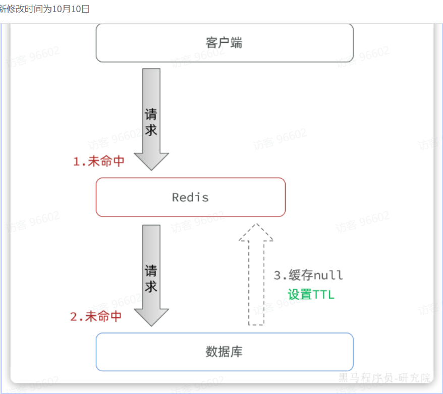

优点：

- 实现简单，维护方便

缺点：

- 额外的内存消耗

#### 6.2.2 布隆过滤器

布隆过滤器是一种用于快速判断 “元素是否在集合中” 的算法，核心特点是**内存占用极小、查询速度快，但存在一定误判率**。

核心原理

1. **基础结构**：由一个超长的 bit 数组（每个位置仅存 0 或 1）和 K 个独立的 hash 函数组成，初始时数组所有位置均为 0。

2. 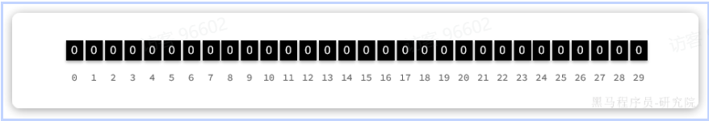

3. **添加元素**：将元素传入 K 个 hash 函数，得到 K 个不同的数组下标，再将这些下标对应的 bit 位从 0 改为 1。

4. 查询元素

   同样将元素传入 K 个 hash 函数，得到 K 个下标。

   - 若这 K 个下标中**任意一个 bit 位是 0**，则元素**一定不在集合中**，直接返回 “不存在”。
   - 若这 K 个下标**所有 bit 位都是 1**，则元素**可能在集合中**（存在误判）。
   - 因此，布隆过滤器的判断存在误差：
     - 当布隆过滤器认为元素不存在时，它**肯定不存在**
     - 当布隆过滤器认为元素存在时，它**可能存在，也可能不存在**
   - 当`bit`数组越大、`Hash`函数`K`越复杂，`K`越大时，这个误判的概率也就越低。由于采用`bit`数组来标示数据，即便`4,294,967,296`个`bit`位，也只占`512mb`的空间
   - 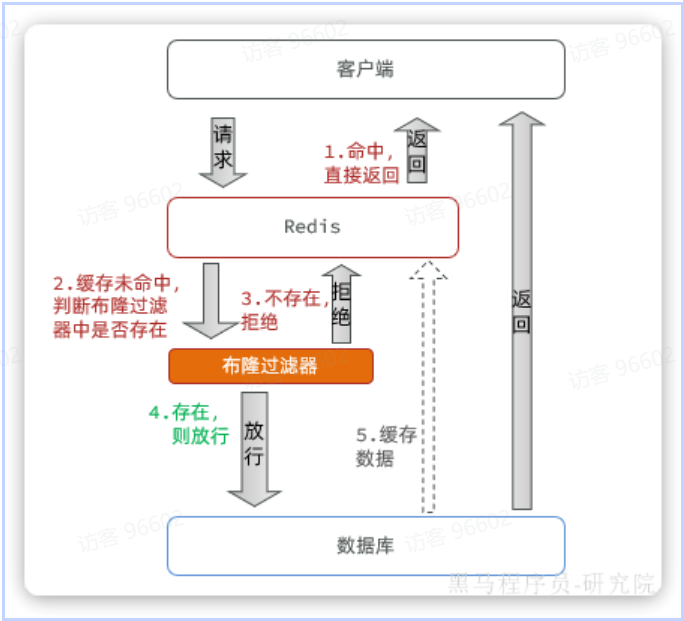

 关键特性与用途

- **误判原因**：不同元素经 hash 函数计算后，可能得到相同的下标（hash 碰撞），导致非集合内元素的查询结果显示 “存在”。
- **降低误判率的方式**：增大 bit 数组的长度、增加 hash 函数的数量（K 值），可让误判率趋近于 0（通常能控制在 0.01% 以内）。
- **实际用途**：缓存未命中时，先通过布隆过滤器判断数据是否存在于数据库。若过滤器判定 “不存在”，则直接拒绝请求，避免无效的数据库查询，减轻数据库压力。
- 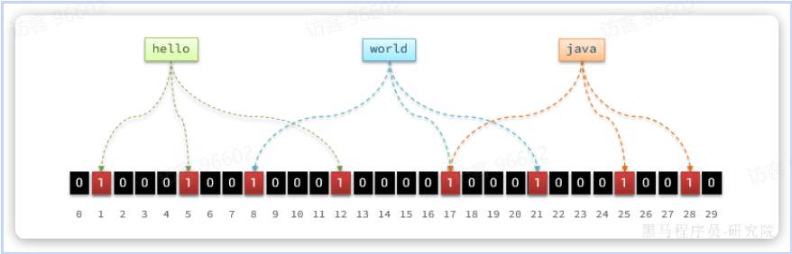

### 6.3 缓存雪崩

缓存雪崩是指在同一时段大量的缓存key同时失效或者Redis服务宕机，导致大量请求到达数据库，带来巨大压力。

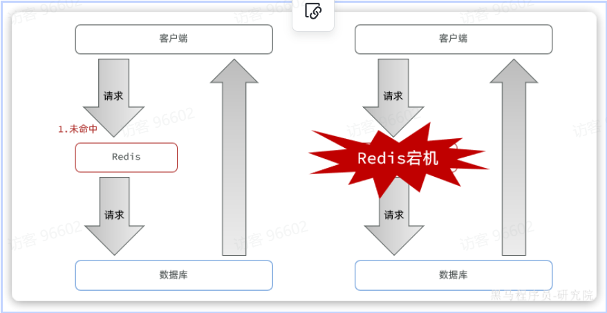

常见的解决方案有：

- 给不同的Key的TTL添加随机值，这样KEY的过期时间不同，不会大量KEY同时过期
- 利用Redis集群提高服务的可用性，避免缓存服务宕机
- 给缓存业务添加降级限流策略
- 给业务添加多级缓存，比如先查询本地缓存，本地缓存未命中再查询Redis，Redis未命中再查询数据库。即便Redis宕机，也还有本地缓存可以抗压力

### 6.4 缓存击穿

**缓存击穿**问题也叫**热点Key**问题，就是一个被高并发访问并且缓存重建业务较复杂的key突然失效了，无数的请求访问会在瞬间给数据库带来巨大的冲击。

由于我们采用的是`Cache Aside`模式，当缓存失效时需要下次查询时才会更新缓存。当某个key缓存失效时，如果这个key是热点key，并发访问量比较高。就会在一瞬间涌入大量请求，都发现缓存未命中，于是都会去查询数据库，尝试重建缓存。可能一瞬间就把数据库压垮了。

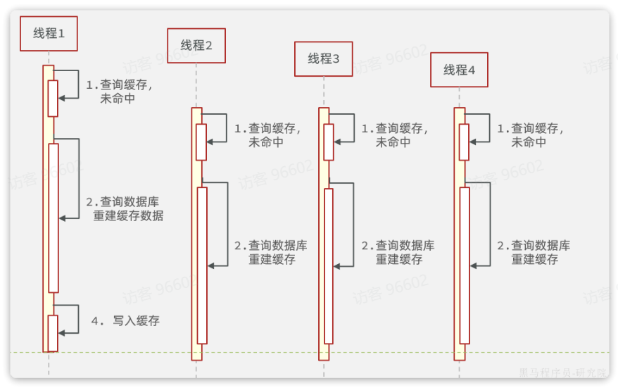

如上图所示：

- 线程1发现缓存未命中，准备查询数据库，重建缓存，但是因为数据比较复杂，导致查询数据库耗时较久
- 在这个过程中，一下次来了3个新的线程，就都会发现缓存未命中，都去查询数据库
- 数据库压力激增

常见的解决方案有两种：

- 互斥锁：给重建缓存逻辑加锁，避免多线程同时指向
- 逻辑过期：热点key不要设置过期时间，在活动结束后手动删除。
- 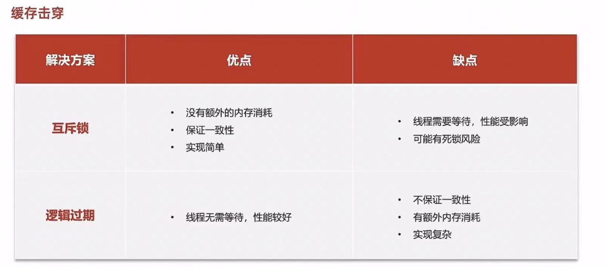

一个是时间换一致性，一个是空间换可用性

基于互斥锁的方案如图：

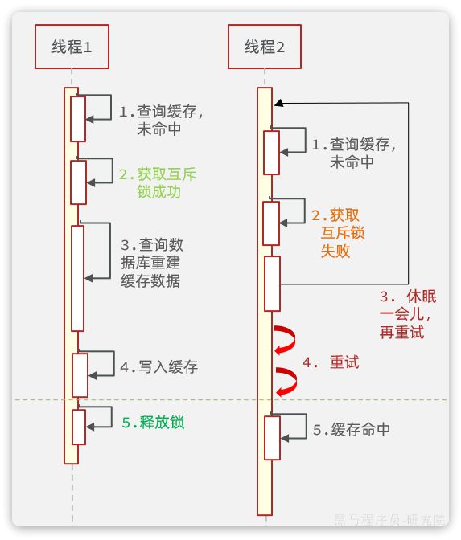

逻辑过期的思路如图

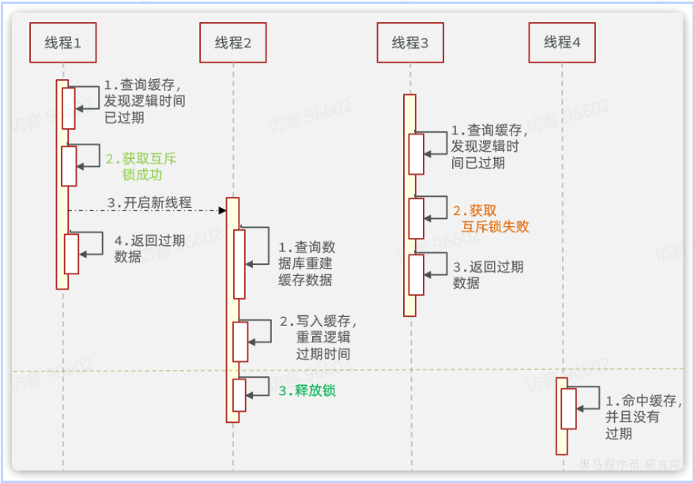

这里有关逻辑过期部分我不太理解，问了豆包才恍然大悟：

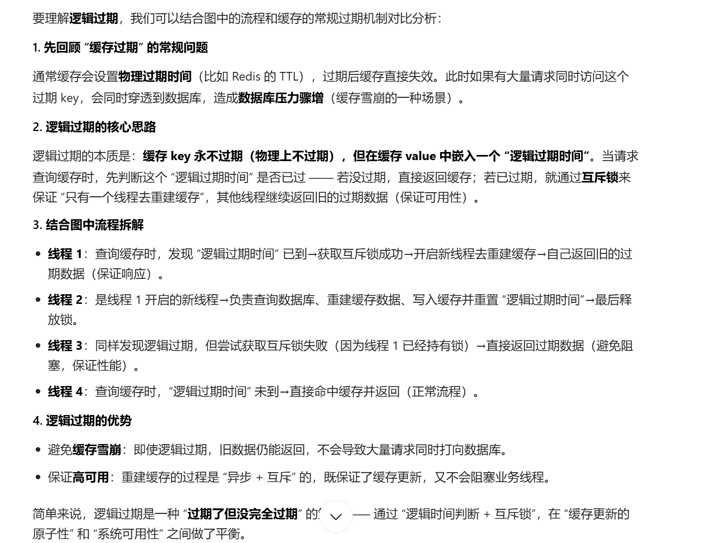

PS：评论有个大神想了一个更好应对缓存雪崩的方案，大家可以看看

优化方案：对即将过期的热点 key，用异步线程提前更新缓存，更新时加互斥锁避免并发更新。锁仅限制更新操作，允许读线程访问旧数据。更新失败保留旧数据并重试，动态调整提前触发时间，用线程池管控异步任务。

问题21:**面试题**：**如何保证缓存的****双写一致性**？

**答**：缓存的双写一致性很难保证强一致，只能尽可能降低不一致的概率，确保最终一致。我们项目中采用的是`Cache Aside`模式。简单来说，就是在更新数据库之后删除缓存；在查询时先查询缓存，如果未命中则查询数据库并写入缓存。同时我们会给缓存设置过期时间作为兜底方案，如果真的出现了不一致的情况，也可以通过缓存过期来保证最终一致。

**追问**：为什么不采用延迟双删机制？

**答**：延迟双删确实是一种常用的缓存一致性优化方案，它的核心是：先更新数据库、立即删除缓存，然后延迟一段时间再删一次缓存，以降低高并发下缓存被旧数据覆盖的概率。

但是，我们项目没有采用延迟双删，主要原因有三点：

1. **时间窗口难以精确控制**：延迟时间一般是经验值，很难保证在所有高并发情况下都能避免脏数据。
2. **增加系统复杂度**：需要定时任务或者异步操作来再次删除缓存，逻辑和运维成本都会增加。
3. **最终一致性可接受**：我们采用 Cache Aside 模式，更新数据库后直接删除缓存，同时给缓存设置 TTL 作为兜底方案，即使出现短时间不一致，也能最终恢复一致状态。

所以，从安全性、可靠性和维护成本综合考虑，直接使用 Cache Aside 模式更简单、可控，也符合业务需求。

问题22：**面试题**：**如何解决缓存穿透问题**？

**答**：缓存穿透也可以说是穿透攻击，具体来说是因为请求访问到了数据库不存在的值，这样缓存无法命中，必然访问数据库。如果高并发的访问这样的接口，会给数据库带来巨大压力。

我们项目中都是基于布隆过滤器来解决缓存穿透问题的，当缓存未命中时基于布隆过滤器判断数据是否存在。如果不存在则不去访问数据库。

当然，也可以使用缓存空值的方式解决，不过这种方案比较浪费内存。

问题23：**面试题**：**如何解决缓存雪崩问题**？

**答**：缓存雪崩的常见原因有两个，第一是因为大量key同时过期。针对问这个题我们可以可以给缓存key设置不同的TTL值，避免key同时过期。

第二个原因是Redis宕机导致缓存不可用。针对这个问题我们可以利用集群提高Redis的可用性。也可以添加多级缓存，当Redis宕机时还有本地缓存可用。

问题24：**面试题**：**如何解决缓存击穿问题**？

**答**：缓存击穿往往是由热点Key引起的，当热点Key过期时，大量请求涌入同时查询，发现缓存未命中都会去访问数据库，导致数据库压力激增。解决这个问题的主要思路就是避免多线程并发去重建缓存，因此方案有两种。

第一种是基于互斥锁，当发现缓存未命中时需要先获取互斥锁，再重建缓存，缓存重建完成释放锁。这样就可以保证缓存重建同一时刻只会有一个线程执行。不过这种做法会导致缓存重建时性能下降严重。

第二种是基于逻辑过期，也就是不给热点Key设置过期时间，而是给数据添加一个过期时间的字段。这样热点Key就不会过期，缓存中永远有数据。

查询到数据时基于其中的过期时间判断key是否过期，如果过期开启独立新线程异步的重建缓存，而查询请求先返回旧数据即可。当然，这个过程也要加互斥锁，但由于重建缓存是异步的，而且获取锁失败也无需等待，而是返回旧数据，这样性能几乎不受影响。

需要注意的是，无论是采用哪种方式，在获取互斥锁后一定要再次判断缓存是否命中，做dubbo check. 因为当你获取锁成功时，可能是在你之前有其它线程已经重建缓存了。

